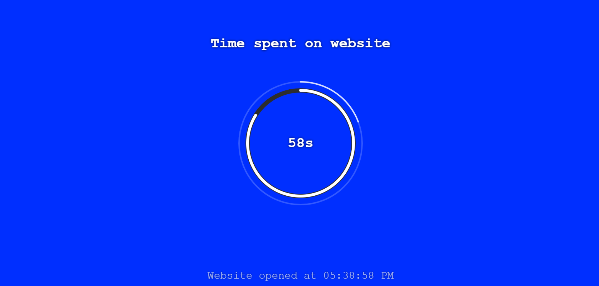

# Time Counter Website
A basic website that counts the time spent on the website. It is made without using HTML tags.
 

**Demo Link**

 

https://nauticos.github.io/Time-Counter-Website/ <= You can try out my website at this link.

This is an example of my website in action.

There is a loading circle that lasts 10 seconds, and after 10 seconds the background colour changes.

The timer will keep counting forever, as long as you stay on the page. If you reload, it will reset.

Made for Tagless Hack Club.
